# 2024_ia651_velagapudi

# Seoul Bike Sharing System Dataset

## Table of Contents

- [Overview](#Overview)
- [Dataset Details](#Dataset Details)
- [Objectives](#Objectives)
- [Exploratory Data Analysis EDA](#Exploratory Data Analysis EDA)
  - [Distribution of features](# Distribution of features)
- [Modeling](#modeling)
  
  - [Model Evaluation](#model-evaluation)
- [Results](#results)
- [Conclusion](#conclusion)
- [References](#references)

## Overview

The dataset contains count of public bicycles rented per hour in the Seoul Bike Sharing System, with corresponding weather data and holiday information

This dataset is taken from uci machine learning repository
https://archive.ics.uci.edu/dataset/560/seoul+bike+sharing+demand

## Dataset Details

The dataset includes the following features:

- **Rented Bike Count**: The number of bikes rented per hour.
- **Weather Information**:
  - **Temperature**: Temperature in degrees Celsius.
  - **Humidity**: Relative humidity percentage.
  - **Windspeed**: Wind speed in meters per second.
  - **Visibility**: Visibility in meters.
  - **Dewpoint**: Dewpoint temperature in degrees Celsius.
  - **Solar Radiation**: Solar radiation in watts per square meter.
  - **Snowfall**: Snowfall amount in millimeters.
  - **Rainfall**: Rainfall amount in millimeters.
- **Date Information**:
  - **Date**: year-month-day
  - **Hour**: Hour of he day
- **Holiday**: Information on whether the date is a holiday.(Holiday/No holiday)
- **Functioning Day** - Information on whether the date is a Fucntioning Day.(Yes/No)
- **Number of Instances**: 8760

The dataset has no missing values

## Objectives

Currently Rental bikes are introduced in many urban cities for the enhancement of mobility comfort. It is important to make the rental bike available and accessible to the public at the right time as it lessens the waiting time. Eventually, providing the city with a stable supply of rental bikes becomes a major concern. The crucial part is the prediction of bike count required at each hour for the stable supply of rental bikes. 

This project aims to predict Rented Bike Count variable based on several input features

Random forest regression model will be built as other regression techniques such as Linear regression will fail to capture nonlinear relationships and the amount data might not be enough for training neural entworks. Random forests are popular and do well in multivariate regression and are less likely to overfit as the final prediction is average prediction of multiple trees

## Exploratory Data Analysis EDA
Sample Data
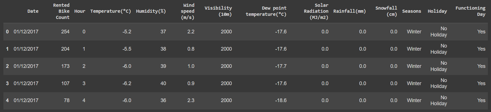

Data is split into train and test sets with test size of 0.4 and random state of 42\
Only training data is used in exploratory data analysis to avoid data leakage\
Year and Weekday are extracted from datetime column

### Distribution of features
Numerical Features
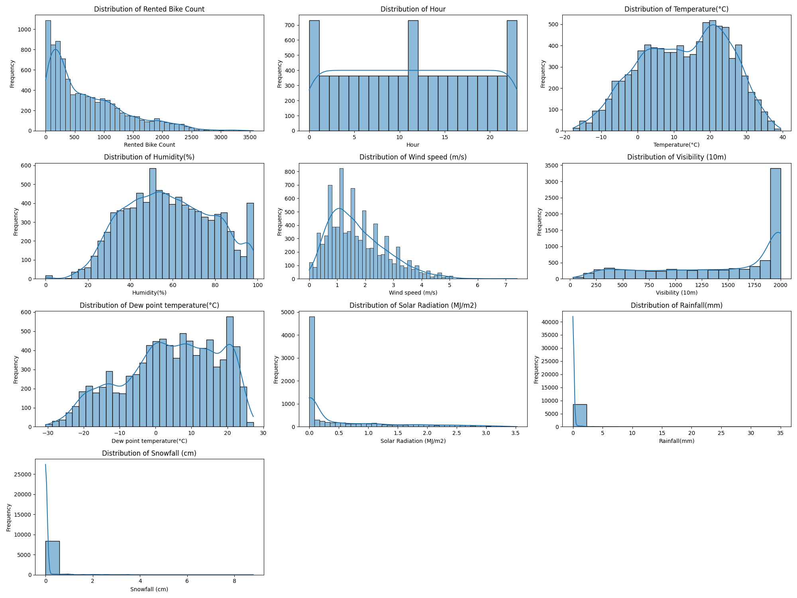

Categorical Features
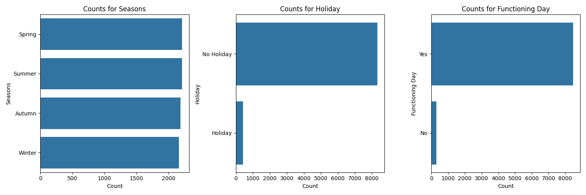

### Correlation Matrix
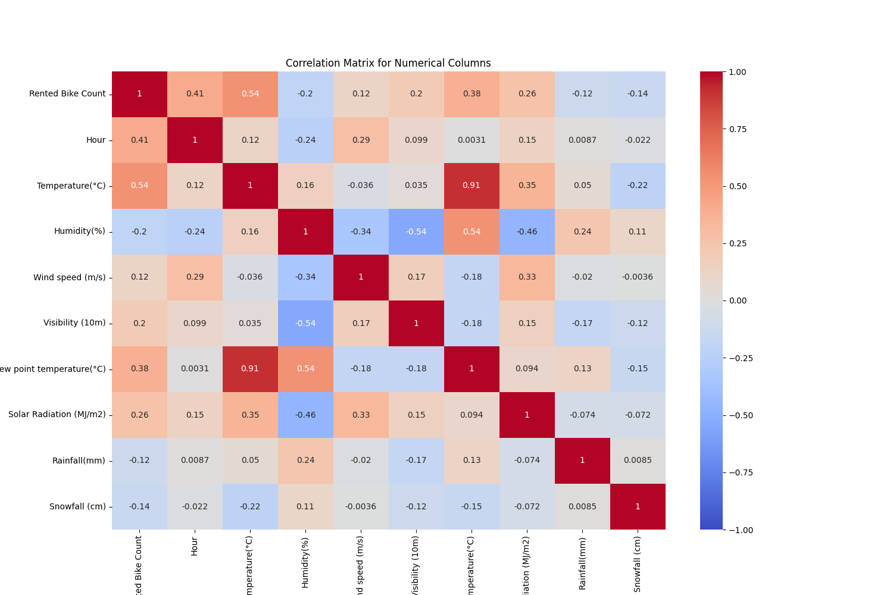

### Exploratory Stats
Average Rented Bike Count by Season and Holiday
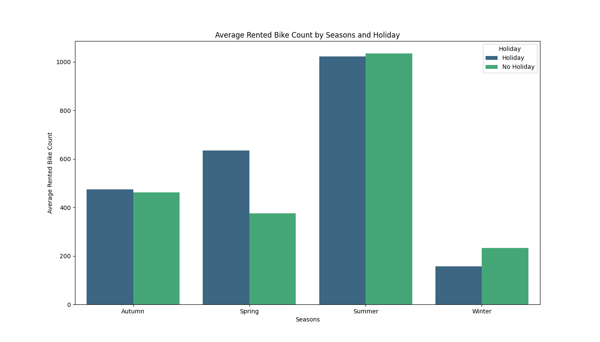

Average Rented Bike Count by Hour
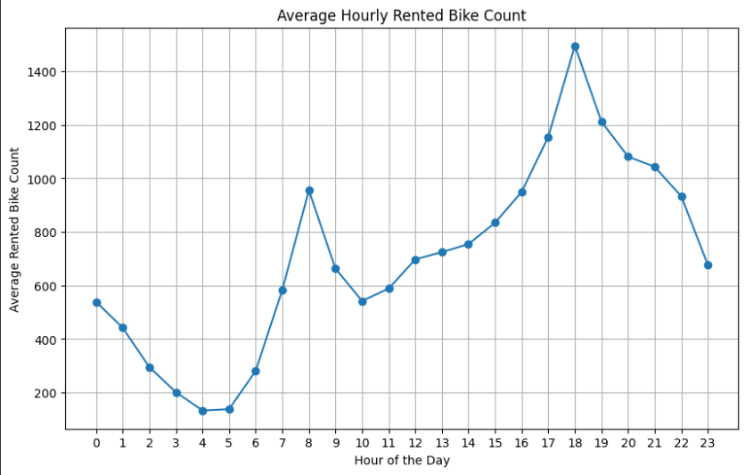

Average Rented Bike Count by Functioning Day

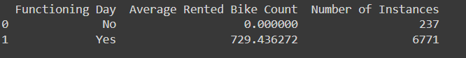

As the average rented bike count is 0 for non functioning days, The model will be adjusted to predict 0 everytime functioning day is 0

Average Rented Bike Count by Holiday

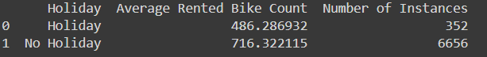

Mean rented bike count by year

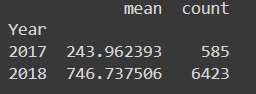

Mean(average of middle 50% values to avoid outliers) rented bike count by year

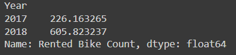

Mean rented bike count by weekday

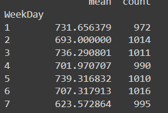

## Feature selection -
All numerical features are selected as they are well correlated with the target variable(Rented Bike Count) as all absolute correlation values are 0.1 and greater

All categorical columns(Functioning day,Holiday,Season) are also selected as they are significantly impacting(from EDA above there is significant variation in Rented Bike Count for different values of these categorical variables) Rented Bike Count.

Hour is signifcantly impacting Rented Bike Count (see Hour vs Rented Bike Count plot) and It has positive correlation of 0.42 with Rented Bike Count(see Correlation matrix) indicating increasing trend on average as hour of the day increases and Daily routines often vary by hour, making it an important factor to consider.

Year is included as there is significant difference in Mean Rented Bike Count by Year. Note that the model will be trained only on 2017 and 2018 data when a new year is introduced the model cant make reliable predictions; a solution for that is suggested at the end.

Weekday is included as there is substantial difference in Mean Rented Bike Count by Weekday and it could be a required factor as weekly routines are common.

Date and Month are not included to avoid turning it into a time series model as Random forest can't handle time series data well enough and to focus to building a simple more generalized model based on non datetime input features, Hour and weekday are included to capture very common obvious routines. 

## Feature engineering -
Categorical variables Functioning day and Holiday are numerically encoded as they are binary categorical variables\
Season and Weekday are label encoded numerically for the following reasons

1.One Hot encoding is not suitable for Random Forest Model as it increases tree complexity which could be more prone to making bad predictions.\
2.Tree models handle numerical label encoding as they can make very precise splits.

Weekday- {'Monday': 1, 'Tuesday': 2, 'Wednesday': 3, 'Thursday': 4, 'Friday': 5, 'Saturday': 6, 'Sunday': 7}\
Holiday- {'Holiday': 0, 'No Holiday': 1}\
Functioning day- {'Yes': 1, 'No': 0}\
Seasons- {
    'Autumn': 0,
    'Spring': 1,
    'Summer': 2,
    'Winter': 3
}\
Hour is already label encoded\
Features are not scaled because random forest decision tree model does not require featuring scaling

Data After Feature Engineering
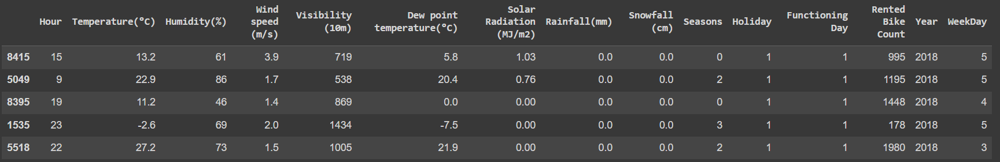

## Final Model
A Random Forest model with parameters n_estimators=100,bootstrap=True is trained on trainset and tested using cross validation with n=3

Results

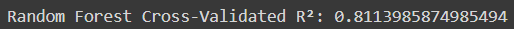

Feature importance

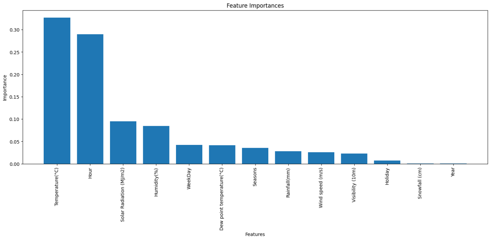

Year feature has very low importance even though it was deliberately included so it is dropped and cross validation score is calculated again

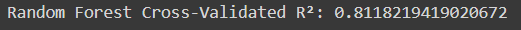

Year has no effect on accuracy so it is not used in final model

Final model is trained with best parameters found using gridsearch\
param_grid = {
    'min_samples_leaf': [1, 2, 4, 6, 8, 10],
    'max_depth': [None, 10, 20, 30, 40, 50]
}

Performance on trainset

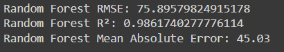

Prediction examples 

Test example 1:\
Input features:\
{'Hour': 8.0, 'Temperature(°C)': 27.2, 'Humidity(%)': 69.0, 'Wind speed (m/s)': 1.8, 'Visibility (10m)': 1999.0, 'Dew point temperature(°C)': 21.0, 'Solar Radiation (MJ/m2)': 0.7, 'Rainfall(mm)': 0.0, 'Snowfall (cm)': 0.0, 'Seasons': 2.0, 'Holiday': 1.0, 'Functioning Day': 1.0, 'WeekDay': 5.0}
Actual: 1728
Predicted: 2112.86

Test example 2:\
Input features:\
{'Hour': 12.0, 'Temperature(°C)': 32.6, 'Humidity(%)': 51.0, 'Wind speed (m/s)': 2.1, 'Visibility (10m)': 800.0, 'Dew point temperature(°C)': 21.1, 'Solar Radiation (MJ/m2)': 3.21, 'Rainfall(mm)': 0.0, 'Snowfall (cm)': 0.0, 'Seasons': 2.0, 'Holiday': 1.0, 'Functioning Day': 1.0, 'WeekDay': 5.0}
Actual: 822
Predicted: 591.27

Synthesized example 1:\
Input features:\
{'Hour': 10.0, 'Temperature(°C)': 25.0, 'Humidity(%)': 40.0, 'Wind speed (m/s)': 2.0, 'Visibility (10m)': 2000.0, 'Dew point temperature(°C)': 15.0, 'Solar Radiation (MJ/m2)': 0.5, 'Rainfall(mm)': 0.0, 'Snowfall (cm)': 0.0, 'Seasons': 0.0, 'Holiday': 1.0, 'Functioning Day': 1.0, 'WeekDay': 1.0}
Predicted: 838.01

Synthesized example 2:\
Input features:\
{'Hour': 14.0, 'Temperature(°C)': 30.0, 'Humidity(%)': 50.0, 'Wind speed (m/s)': 3.5, 'Visibility (10m)': 1500.0, 'Dew point temperature(°C)': 20.0, 'Solar Radiation (MJ/m2)': 0.1, 'Rainfall(mm)': 0.1, 'Snowfall (cm)': 0.1, 'Seasons': 3.0, 'Holiday': 1.0, 'Functioning Day': 1.0, 'WeekDay': 7.0}
Predicted: 377.41

Random forests are usually less prone to overfitting because predictions are averaged across multiple trees

Note that random forest model could give slightly different results every time it's trained because of bootstrapping(training on random subsets of training data) but its only a slight difference.

## Limitations
This Model is Statistical and cannot make exact predictions.\
Random Forest models are not easily interpretable compared to single decision trees.\
This model can give far off predictions as seen in the test example 1 especially with outliers.\
This model is only trained on 2017 and 2018 year data; could give bad predictions for newer years.\
The model cannot forecast unanticipated events for which it is not trained on.

## Production
This model is only trained on 2017 and 2018 year data(year variable has only these two values in training data) so it cant make prediction for newer years.

To make predictions on newer data; metrics like year over year growth or monthly growth in Rented Bikes (forecasted and otherwise) could be incorporated and the final predictions from random forest model could be adjusted based on those metrics.

Model could be further improved by increasing number of datapoints, selecting other relevant variables based on domain knowledge such as Traffic data, Geographic data etc. 

